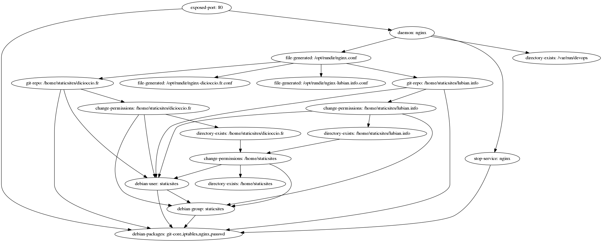
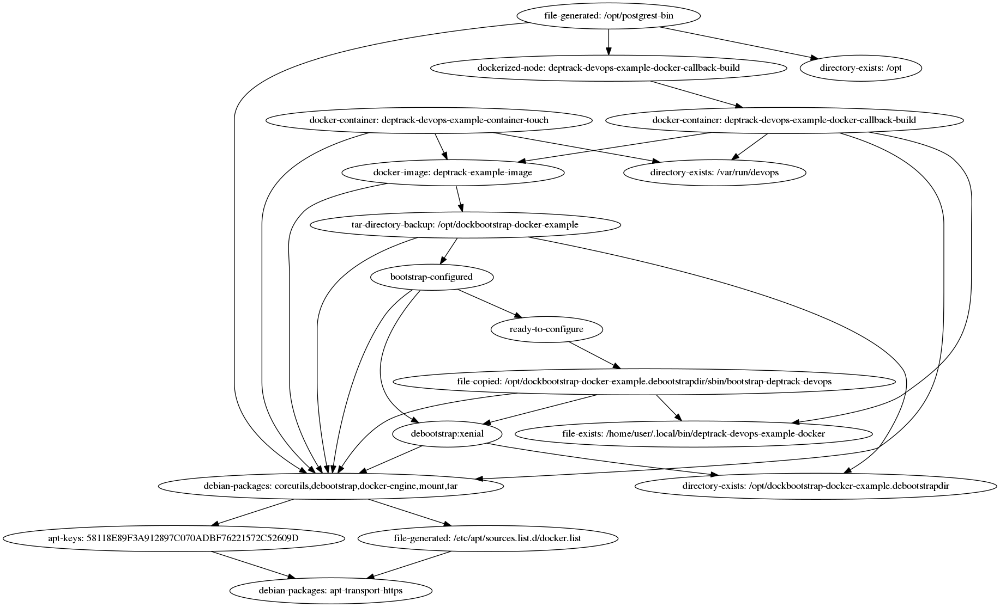
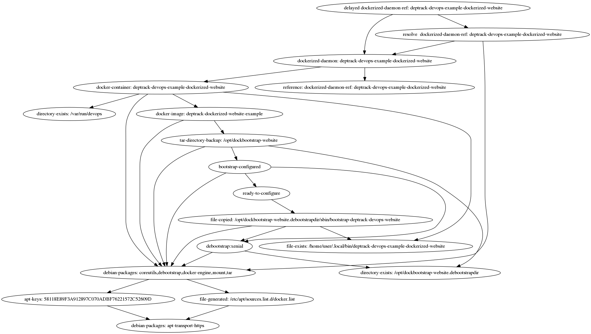
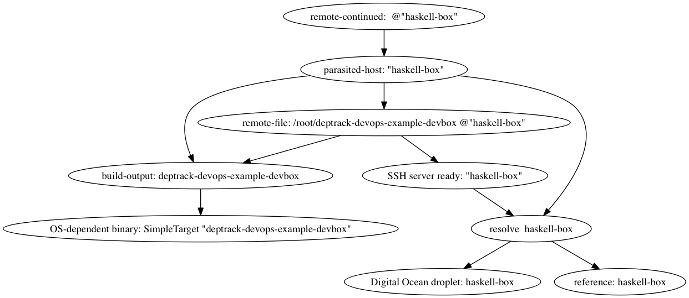
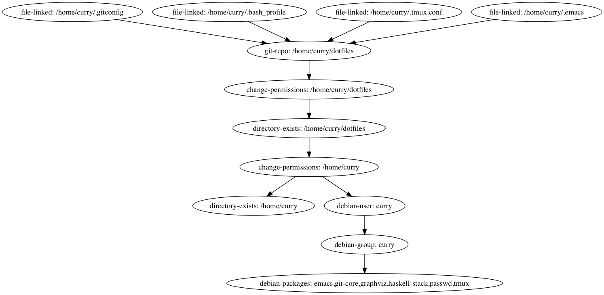

DepTrack for Devops: some examples
==================================

This repository shows examples of how to use DepTrack for Devops.

This repository contains examples (currently one) which are binaries built from
the `app/` directory and which pull a default main library. This default main
contains a primitive command line parser as well as some boilerplate wiring;
this way, one can take a declarative approach when describing some piece of
infrastructure. A real application would organize descriptions in library
modules and provide some better user frontend (e.g., a command line with
optparse-applicative or a web frontend).

# Prerequisites
- you need a linux system (tested on Ubuntu16.04)
- you need git to clone this repository
- you need to have installed The Haskell Tool Stack

# Installation and usage of examples

One can build all examples from the deptrack-devops-examples repository `stack
install`.  If everything goes well, you'll get something like `Copied
executables to /home/devop/.local/bin:` ; add this directory to your `PATH` and
you'll get binaries using the default main.

Binaries using the default main accept exactly one argument:
- list: shows tuples of (node-ID, node-description) in increasing node-ID
  order; node-ID are hashes of the description
- print: prints a tree-based representation of the dependencies
- dot: output a graphviz-language graph representation of the dependencies,
  roots represent highest-level goals
- check-dot: like dot but first checks every statuses to pinpoint broken nodes
- up: turns up every node in the graph, starting from the leaves and towards
  the roots, maximizing concurrency when multiple branches are available
- down: turns down every node in the graph, starting from the roots and towards
  the leaves
- upkeep: runs continuously trying to keep up every node in the graph (i.e.,
  periodically check them)

Running such binaries with other set of arguments will show you a summary:
```
deptrack-devops default main:
  Available arguments:
    up, down, upkeep, print, dot, check-dot, list
```

# deptrack-devops-example-devtools

This target is a simple first example. I use a similar system when starting
a new VM where I'll be developping, I need some packages, my VIM configuration
etc. The code has a `main` function which passes the command-line arguments to
the defaul main; the default optimization is to batch all debian packages
together (i.e., this way we apt-get install them all at once, we do not fear
locking when we concurrently operate the graph).

The output of `dot -Tpng -o deptrack-devops-example-devtools.png <( deptrack-devops-example-devtools dot )`
is as follows:


We observe a number of things:
- some nodes map one-to-one with the description in the code (e.g., dotfiles generation)
- some nodes were not expressed in the graph: the library code in
  deptrack-devops-recipes does this work underneath (e.g., adding an apt
  repository to install the Haskell Stack tool)
- all Debian packages have been lumped into a single node (as per the optimization)

# deptrack-devops-example-website

This target configures NGinx for serving two static websites cloned from
GitHub.

The output of `dot -Tpng <( deptrack-devops-example-website dot ) > deptrack-devops-example-website.png` is as follows:


This graph shows an intermediary-difficulty example: we want to serve static
sites. Static sites code is hosted on GitHub. Hence, we need to git-cloned from
GitHub.  We plan to use NGinx as a server.

As a result, we need to install Git and NGinx, but also generate some NGinx
configuration. Encoding these steps as a dependency graph ensures that we never
start NGinx for a missing website: that would not typecheck.  There's a node
named "stop-service: nginx", which corresponds to taking over systemd's
responsibility to start NGinx (the service will be auto-started after
installation or at start time -- this is not what we wish for).

Note that the static sites repositories contain plain HTML rather than source
code of a static generator. Also, NGinx will serve the git-clone output and the
.git hidden directory will be served by nginx. As an exercise you can try
modifying this example to clone some source code and run a generator to output
the HTML directory contents.

# deptrack-devops-example-postgrest

This target is a more involved example. We want to play with PostGrest, and
excellent REST-api provider for any PostGreSQL database. We want to get the
dev-branch for PostGrest hence we need to build it from its Git source.  We
also need to install PostGre and configure a user and a database.

The output of `dot -Tpng -o deptrack-devops-example-postgrest.png <( deptrack-devops-example-postgrest dot )`
is as follows:


This graph is more complicated than the previous one. We can see the many
operations required to administrate a simple database. And a lot is missing!
No backups are defined, there are no table creations (and hence Postgrest will
have nothing to serve). Though, you get the feeling of how to improve this
example; creating a few tables and views could be a good addition to this
example (I'm currently leaving this for future work).

# deptrack-devops-example-qemu

This target is a seriously big one. Marvel at the beautiful requirements to
build and start a virtual machine from scratch, including a local DHCP and DNS
servers.

The output of `dot -Tpng -Grankdir=LR -o deptrack-devops-example-qemu.png <( deptrack-devops-example-qemu $HOME/.ssh/authorized_keys dot )`
is as follows:


This graph shows two large chunks: one for the networking, and one for the
base-image.  The networking part is not really that interesting: we build a
network with _tap interfaces_, the Haskell type system ensures that the
definition for a Qemu daemon has some network, and everything follows
(including, configuring a DHCP, and a DNS server).  The base image is more
interesting. We use _qemu-nbd_ to provision an empty Qemu disk and we mount it
locally, then we leverage _debootstrap_ to provision a Ubuntu16.04 environment.
A working image requires more than just a debootstrap. For instance, the
debootstraped image will not have a sudo user we can SSH into. Hence, we need
extra configuration. Rather than creating specific DevOp functions for
provisioning the image mounted at a specific location, we can use generic DevOp
functions to provision from within a chroot. When we turnup this example, the
binary will copy itself into the mounted image, then call itself back using
_chroot_. This callback mechanism works because this example binary parses
command line arguments slightly differently from the `simpleMain` (i.e., some
magic value triggers the codepath for provisioning the chroot),

# deptrack-devops-example-docker

Docker is all the craze these days. This installs it and bootstraps a fresh
base image from nothing, then starts two containers based on this fresh image.

The output of `dot -Tpng -o deptrack-devops-example-docker.png <( deptrack-devops-example-docker dot )`
is as follows:


This graph has three interesting nodes. One one hand, we create a base
_docker-image_ with `docker import` from a debootstrapped environment. To
customized the debootstrapped environment, we used a _chroot_ exactly like we
did in the deptrack-devops-example-qemu example. On the other hand a pair of
_docker-container_ nodes exist. Although they look similar they actually are
not. The `deptrack-devops-example-container-touch` container merely builds a
container which runs a `touch hello-world` in the containerized environment.
This is possible because we _know_ that the debootstrap chroot has installed
the `touch` command. Sometimes, we want to couple the content of the docker
program more tighlty: what if we need to turnup more things? In particular,
there coule be things we want to turnup but that cannot be _installed_ during
the chroot setup (such as a running daemon). We actually can callback more
DepTrack-Devops nodes from within the Docker container as the command to run
when starting the container. This callback technique is implemented as the
`deptrack-devops-example-docker-callback-build` in the above example. One
advantage here is that since we create the Docker image and container, we can
`docker copy` a binary we know ahead of time and then call this binary. This
callback setup is pretty oblivious to the type of nodes we need to turnup (say,
a Nginx server or anthing you can express using DepTrack DevOps). As a result,
we provide a `dockerize` function that turn-ups arbitrary serializable DevOps
from within Docker containers. One key advantage of this technique is that GHC
(the Haskell compiler) will know the type of the node running in the Docker
container, which can let you build complex but type-checked infrastructures.
In this example, we build the PostGrest binary in the Docker container (using
the same code as in the deptrack-devops-example-postgrest example, but
copy/pasted because we organized examples so that everything is the Main
module) and we then copy the binary outside. One could build upon this example
to then configure PostGreSQL locally.

The serialization mechanism leverages
 and the
StaticPointers GHC extension.

The code in `app/Docker.hs` is laid out to show the two various callback
mechanisms (in the chroot: we use a hardcoded path into the code; whereas in
docker: we interpret a Base64-encode closure that was passed before).

# deptrack-devops-example-dockerized-website

This example is similar to `deptrack-devops-example-docker` above.

The output of `dot -Tpng -o deptrack-devops-example-dockerized-website.png <(
deptrack-devops-example-dockerized-website dot )` is as follows:


The two main difference with the previous example are as follows:

- uses `App` with `appMain` as a cleaner way to address nested binary calls
  than `simpleMain` with magic arguments.
- uses `Ref` and `delayed` evaluation to wait for an unknown to become
  available (the IP address of the docker container)

# deptrack-devops-example-spark

This example deploys a fresh and working [Apache Spark](http://spark.apache.org) cluster on DigitalOcean infrastructure.

## Usage

This example requires that: 

* You have a working [docker]() installation locally. When you run the executable `deptrack-devops-example-spark` you should have the rights to run `docker run ...`,
* You have a [DigitalOcean](http://digitalocean.com) account and expose an API token in an environment variable `AUTH_TOKEN`.

To build a cluster with 1 master and 2 slaves, run:

    $ deptrack-devops-example-spark 2 spark-cluster 1234567 up

where `spark-cluster` is the base name for creating the droplets and `1234567` is the DO key reference to set on created droplets to allow SSH access.

If all goes well, this will:

1. create 3 droplets on DO named `spark-cluster-master`, `spark-cluster-slave-1` and `spark-cluster-slave-2`,
2. build the executable for linux x64 architecture using a [docker container](https://hub.docker.com/_/haskell/),
3. upload the built executable on the droplets,
4. run the executable remotely to complete configuration of the hosts.

Assuming the master droplet has IP 1.2.3.4 you can then point your browser to http://1.2.3.4:8080/ and you should have access to Spark's dashboard and console.

## Details 

The output of `dot -Tpng -o deptrack-devops-example-spark.png <( deptrack-devops-example-spark spark-cluster 2 123456 dot )`
is as follows:


This graph is rather simple but presents a shortcoming (which should be removed in future incarnations of DepTrack): The dependency graph of DevOp nodes executed remotely on droplets is not shown.

It has two symetric subgraphs, one for each slave that shall be deployed, with nodes representing the creation of the droplets, the copy of the locally built executable remotely and the remote execution. The slaves depend on the master configuration and the built executable, something which is done only once for all nodes: The same executable will be deployed on all the droplets. To handle processing remote configuration of the droplets we use a technique similar to what's done for *docker-based* configurations (see above): A [Static pointer](https://downloads.haskell.org/~ghc/7.10.1/docs/html/users_guide/static-pointers.html) (see also [Mathieu Boespflug](https://ocharles.org.uk/blog/guest-posts/2014-12-23-static-pointers.html) post) for the node to be triggered is encoded as a base64 binary and passed as an argument to the executable when run remotely. We add an additional twist by passing a dynamic argument (the IP addresses) to the closure. 


# deptrack-devops-example-devbox

This example deploys a haskell development box on digital ocean, using some [dotfiles](https://github.com/abailly/dotfiles) to configure the environment. Like the previous one it requires one to have docker installed and access to a DigitalOcean account set up.

The graph is split in 2: One graph for local execution and one for remote execution.

The local graph is:



The remote graph (with transitive dependencies removed) is:


